# Desk

A simulated junior dev team for learning to program. It reviews your code, keeps track of what you keep getting wrong, and decides what you should do next.

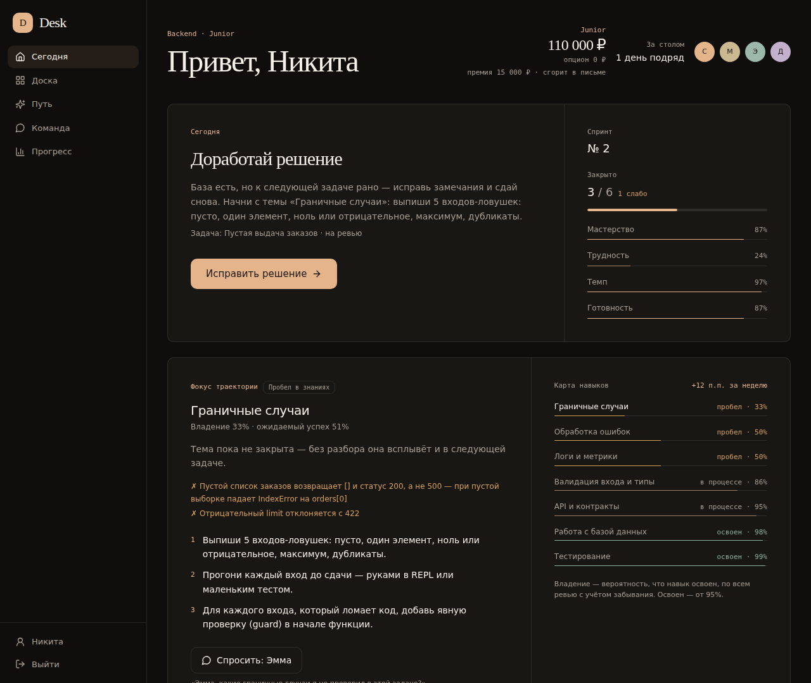

**Status:** research prototype. All services, the client and the agent pipelines are implemented and unit-tested, but nothing has been evaluated with real students yet. What I have measured is how the pieces behave in tests and in simulation. The [limitations](#limitations) section says what that does and does not show.

The interface is in Russian. Screenshots use sample data.

## What it is

A student picks a track (backend, frontend or fullstack) and a level. They get a project split into sprints, and each sprint is a kanban board. They write code in the browser and submit it. A pipeline of LLM agents and deterministic checks reviews the submission against acceptance criteria. Each task allows two attempts by default. Four AI teammates (product, analytics, QA, tech lead) answer questions in a chat.

Between tasks, a knowledge model built from the review outcomes decides what happens next: fix one specific criterion, ask one specific teammate, repeat a skill that is fading, or take a particular task from the board. At the end of a sprint the student gets a performance-review letter with a grade and salary change. The whole thing is meant to feel like the first months of a job.

It is about 39,000 lines of Python across five services and 8,000 lines of TypeScript, with 562 unit tests.

## Eleven things worth a look

1. **A reviewer that cannot grade by feel.** The final score is computed. The LLM agents fill in a rubric, and the number comes from the rubric pass rate, capped by hard evidence: broken syntax, failing tests, objections from a second reviewer, skipped steps in the process. An agent cannot talk its way past a cap. See [the review pipeline](#the-review-pipeline).

2. **The code is actually run.** A task can carry hidden tests written by its author. The student runs them from the editor before submitting and sees which ones fail; the review pipeline runs the same tests and treats the result as a fact that caps the score. The two numbers together give the first external yardstick this project has: how often the agents' verdict agrees with execution. See [running the code](#running-the-code).

3. **The review lands in the code.** Each failed criterion and each objection is anchored to a line of the submitted code and underlined in the editor, with the previous attempt one click away as a diff. An anchor is only set when the server can justify it — a wrong highlight is worse than none. See [review in the code](#review-in-the-code-not-beside-it).

4. **The team writes first.** A student who resubmits the same code, or goes quiet after a refusal, does not ask for help. The signal is computed from the submissions, the decision model judges whether a message would help, and Emma writes it into the chat. See [the team writes first](#the-team-writes-first).

5. **Decay has something to do about it.** The knowledge model gives every skill a half-life. When one starts to fade, the student is offered a five-minute drill — one function with hidden tests — instead of another half-day task. The run goes back into the model as a practice event, so retention resets and the half-life grows. See [five-minute repetition](#five-minute-repetition).

6. **The task supply checks itself.** Writing tasks by hand is what runs out first. An admin types a topic and a model drafts the sprint, but nothing is published on the model's word: the server parses the brief, counts the acceptance criteria, runs the hidden tests against the author's reference solution, and then runs them again against a solution with a deliberate bug. Tests that stay green on broken code are thrown away, because they check nothing. See [where the tasks come from](#where-the-tasks-come-from).

7. **Memory that knows when it was true.** What the team remembers about a student is a temporal knowledge graph, not a list of strings: every fact carries the moment it became true, the evidence behind it and a window that closes when it stops holding. Skill nodes are fixed rather than invented by a model, so the graph and the knowledge-tracing estimate talk about the same fourteen skills and get reconciled against each other. A fact may only be overturned by a source no weaker than its own, which is why "I always handle errors now" in the chat cannot erase a failing test. See [memory](#memory).

8. **Knowledge tracing on top of LLM review output.** Each acceptance criterion is mapped to one or two of 14 skills. A Bayesian knowledge tracing model with forgetting turns pass/fail outcomes into a per-skill estimate, and a planner turns that into a next step. I derived the model parameters from behavioural constraints instead of picking them by hand. See [the learning trajectory](#the-learning-trajectory)

9. **The agents are audited too.** Every review and every chat turn records which steps ran. A process check lowers the score if required steps were skipped, and flags a mentor reply that pastes a complete solution.

10. **Decisions are typed, not generated.** The small choices inside the product (who should answer, is this worth remembering, which skill does this criterion test, did the student find the planted bug) go to a decision model that returns probabilities over options I define, not text. It cannot invent an option, and every call has a deterministic fallback behind a confidence gate. See [typed decisions](#typed-decisions).

11. **The domain carries the motivation.** Grades, salary, a bonus that can be spent on extra help, a Friday demo, a night incident, a peer-review task where the student finds a planted bug in code written by an LLM, and badges that are awarded for closed work rather than time spent. What the student is shown depends on their grade. See [the career layer](#the-career-layer).

## Screens

The report after a submission. The score is on the left; the trajectory block says which skill to work on, why, and in which order.

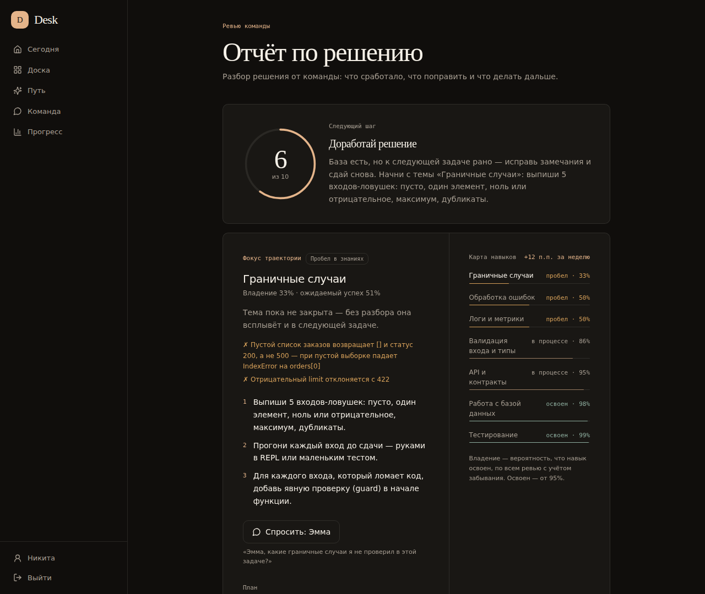

The team chat. The briefing at the top comes from the trajectory, so the teammates start from the same picture of the student.

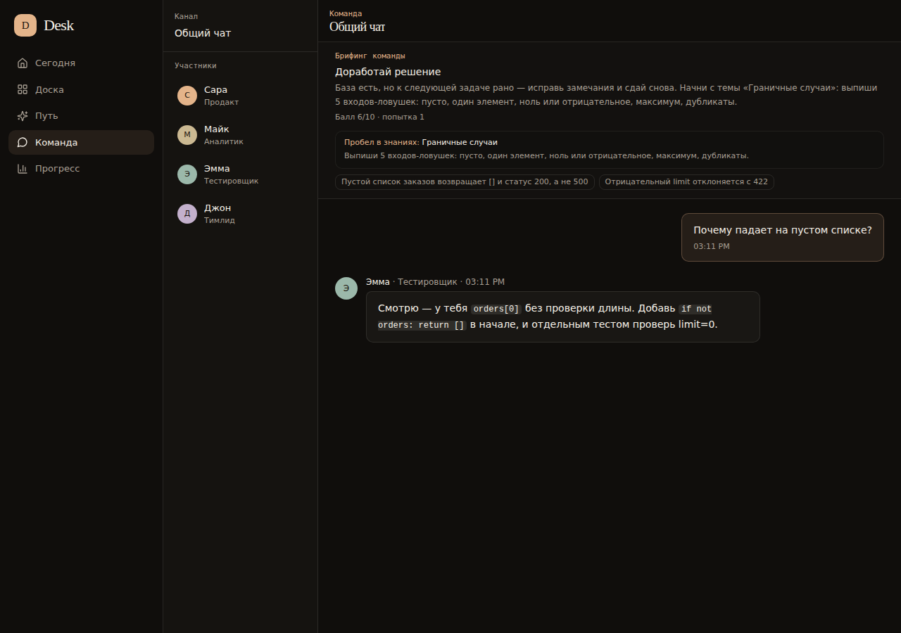

The short feedback loop: the grade ladder, counters, the next goals and the badge shelf. Every number here is server-side and comes from closed work.

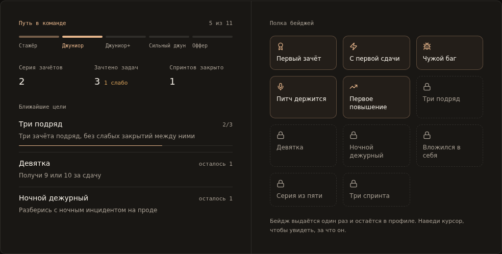

The first screen a new student sees. The whole loop on one card, in the page rather than in a modal, and reachable again from the header.

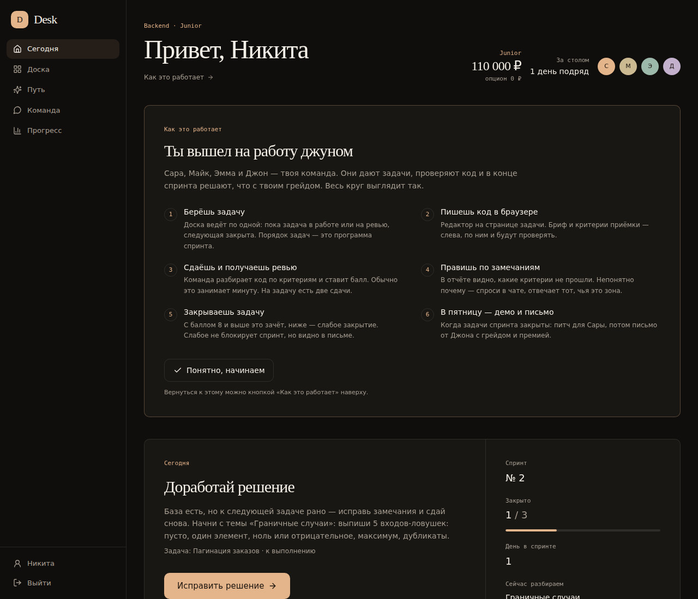

The task page after running the hidden tests. Six of ten pass; the four that fail are named with their assertion messages, and nothing has been submitted yet.

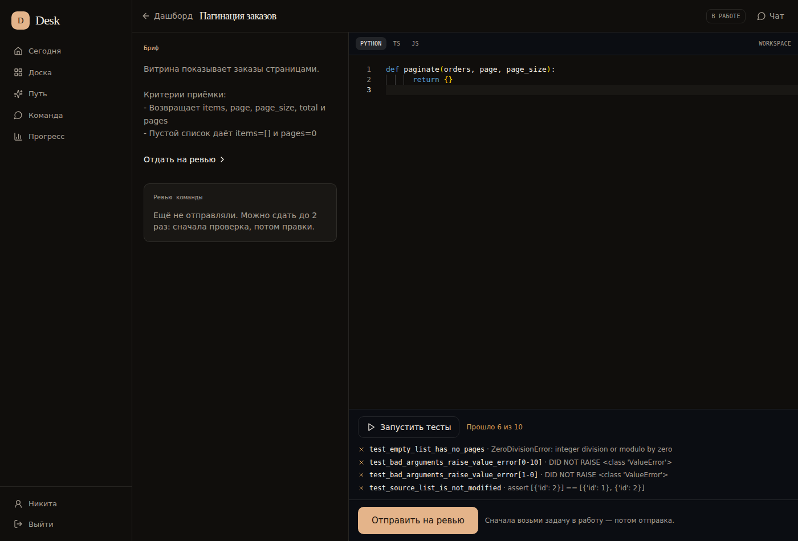

The admin panel drafting a project from a topic. Each line is a verdict from the server, not from the model: what passed, what lost its tests, what was thrown out and why.

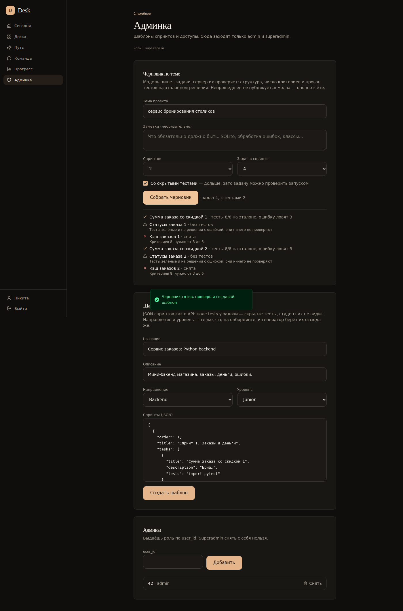

A drill on the dashboard, appearing because the knowledge model says the skill is fading. Two of three tests fail, and the student sees which.

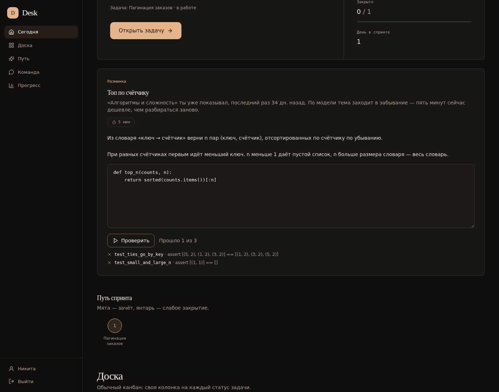

The review inside the editor: two criteria and one objection underlined on the lines they are about, with the previous attempt one click away.

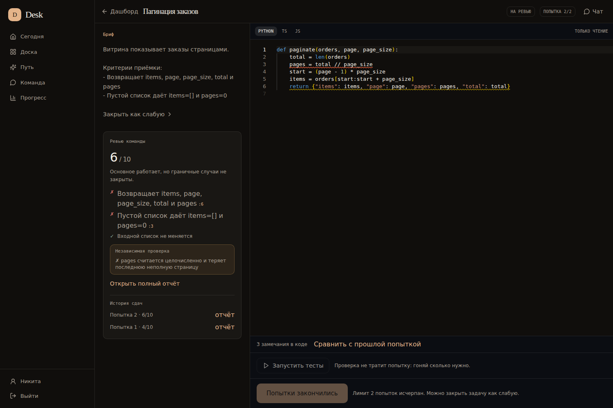

## Architecture

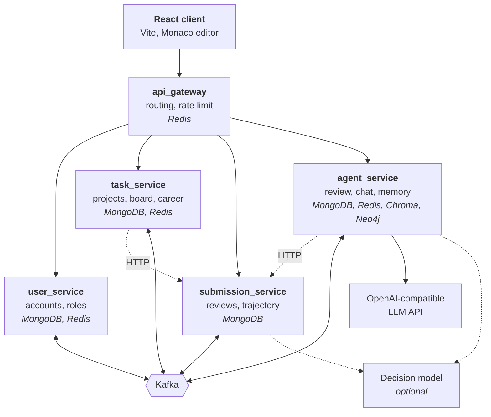
```mermaid
flowchart TB
    UI["<b>React client</b><br/>Vite, Monaco editor"] --> GW["<b>api_gateway</b><br/>routing, rate limit<br/><i>Redis</i>"]
    GW --> US["<b>user_service</b><br/>accounts, roles<br/><i>MongoDB, Redis</i>"]
    GW --> TS["<b>task_service</b><br/>projects, board, career<br/><i>MongoDB, Redis</i>"]
    GW --> SS["<b>submission_service</b><br/>reviews, trajectory<br/><i>MongoDB</i>"]
    GW --> AS["<b>agent_service</b><br/>review, chat, memory<br/><i>MongoDB, Redis, Chroma, Neo4j</i>"]
    TS -.->|HTTP| SS
    AS -.->|HTTP| SS
    US <--> K{{"Kafka"}}
    TS <--> K
    SS <--> K
    AS <--> K
    AS --> LLM["OpenAI-compatible<br/>LLM API"]
    AS -.-> JEV["Decision model<br/><i>optional</i>"]
    SS -.-> JEV
```

| Service | Owns | Notes |
|---|---|---|
| `api_gateway` | Routing of `/api/{user,task,submission,agents}`, rate limiting, sticky balancing | Redis fixed-window limiter, hash-based sticky routing |
| `user_service` | Accounts, access and refresh tokens, sessions, admin roles | Sessions and role cache in Redis |
| `task_service` | Project templates, sprints, the board, the close gate, career state | Read-through Redis cache in front of Mongo |
| `submission_service` | Submissions, the attempt limit, review results, the learning trajectory | Keeps a local cache of task status and description, fed by events |
| `agent_service` | The review graph, the team chat graph, memory, offline evals | LangGraph, ChromaDB, Graphiti over Neo4j (optional), Langfuse tracing (optional) |

Events go over Kafka. Topic names come from settings.

| Event | Producer | Consumer | Why |
|---|---|---|---|
| user registered, profile updated | `user_service` | `task_service` | Keeps the student's direction and level next to their projects |
| task created, status updated | `task_service` | `submission_service` | Lets submissions be validated without a call back to `task_service` |
| submission created | `submission_service` | `agent_service` | Starts a review |
| submission reviewed | `agent_service` | `submission_service` | Stores the review |

Each service is layered as presentation, application (use cases and ports written as `Protocol`s) and infrastructure, and wired with [dishka](https://github.com/reagento/dishka). The rules that matter most, meaning scoring, the trajectory model, the close gate and the career rules, are plain functions with no I/O, so they are tested without any infrastructure.

## Life of a submission

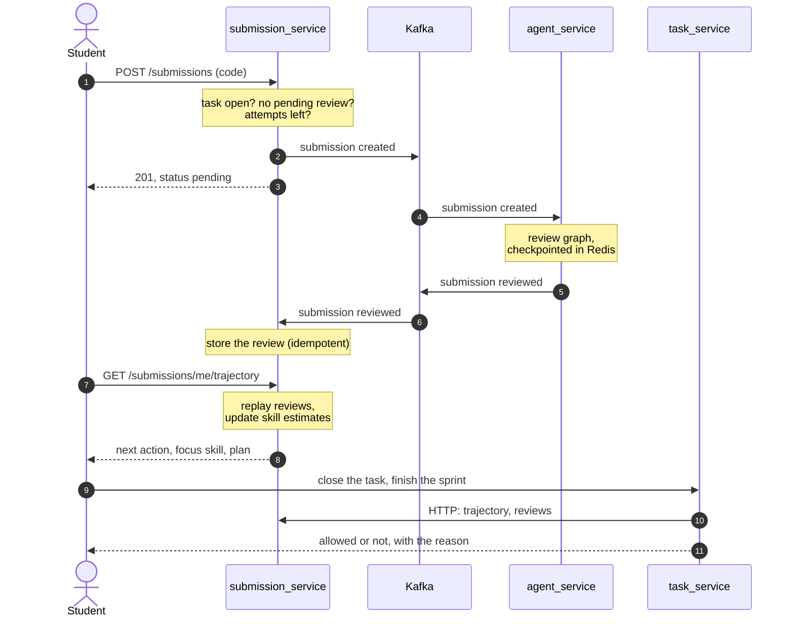
```mermaid
sequenceDiagram
    autonumber
    actor S as Student
    participant SS as submission_service
    participant K as Kafka
    participant AS as agent_service
    participant TS as task_service

    S->>SS: POST /submissions (code)
    Note over SS: task open? no pending review?<br/>attempts left?
    SS->>K: submission created
    SS-->>S: 201, status pending
    K->>AS: submission created
    Note over AS: review graph,<br/>checkpointed in Redis
    AS->>K: submission reviewed
    K->>SS: submission reviewed
    Note over SS: store the review (idempotent)
    S->>SS: GET /submissions/me/trajectory
    Note over SS: replay reviews,<br/>update skill estimates
    SS-->>S: next action, focus skill, plan
    S->>TS: close the task, finish the sprint
    TS->>SS: HTTP: trajectory, reviews
    TS-->>S: allowed or not, with the reason
```

Some details that took a while to get right:

- **One pending review per task, even under a race.** If two submissions arrive at once, the one with the smaller id survives and the other is deleted.
- **Failures are counted fairly.** An infrastructure failure before the review started does not use up an attempt. A review that ran and failed does.
- **Reviews survive restarts.** The review graph is checkpointed in Redis under a key built from the submission, the attempt and a hash of the code. A redelivered Kafka message resumes from the last finished node or reuses a finished result. If the checkpoint store itself fails, the run stops instead of silently starting over.
- **Kafka consumers commit offsets by hand, with retries**, and applying a review result twice has no effect.

## The review pipeline

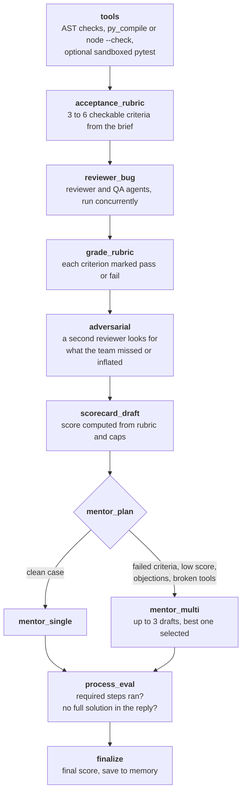
```mermaid
flowchart TD
    T["<b>tools</b><br/>AST checks, py_compile or node --check,<br/>optional sandboxed pytest"]
    A["<b>acceptance_rubric</b><br/>3 to 6 checkable criteria from the brief"]
    RB["<b>reviewer_bug</b><br/>reviewer and QA agents, run concurrently"]
    G["<b>grade_rubric</b><br/>each criterion marked pass or fail"]
    ADV["<b>adversarial</b><br/>a second reviewer looks for<br/>what the team missed or inflated"]
    SC["<b>scorecard_draft</b><br/>score computed from rubric and caps"]
    MP{"<b>mentor_plan</b>"}
    M1["<b>mentor_single</b>"]
    M3["<b>mentor_multi</b><br/>up to 3 drafts, best one selected"]
    PE["<b>process_eval</b><br/>required steps ran?<br/>no full solution in the reply?"]
    F["<b>finalize</b><br/>final score, save to memory"]

    T --> A --> RB --> G --> ADV --> SC --> MP
    MP -->|"clean case"| M1
    MP -->|"failed criteria, low score,<br/>objections, broken tools"| M3
    M1 --> PE
    M3 --> PE
    PE --> F
```

The score is not something a model writes. It is built like this:

```
task, reliability      integers 1..10 from the reviewer and the QA agent
base                   weaker + (stronger - weaker) // 4
rubric score           1 + round(9 * share of criteria passed)
final                  min(base, rubric score, every applicable cap)
```

| Cap | Trigger |
|---|---|
| 2 | Syntax or compilation fails |
| 4 | Tests run in the sandbox and fail |
| 5 | Two or more error-level findings from the tools |
| 5 or 7 | Half or more of the required criteria fail, or some of them fail |
| 5 or 7 | The adversarial reviewer objects with high or medium severity |
| 5 | The process check finds a pasted full solution, or three or more violations |
| 6 | The process check finds that the tools or the sandbox were bypassed |

The adversarial reviewer has deterministic rules of its own. They replace its verdict when the LLM call fails, and they override an LLM that agrees with the team when the rules see a high-severity contradiction, for example a top score for code that does not compile. The tool report also carries earlier reviews of the same task and a short profile of the student, so feedback can refer to what was said before.

**Code execution.** The sandbox is a subprocess in a temporary directory with CPU, memory, process-count and file-size limits, a scrubbed environment and a timeout. It is not container isolation. Running student tests is off by default and cannot be switched on in a production environment. Static analysis and compilation always run, for Python and JavaScript. A missing Node.js makes the JavaScript check fail rather than pass.

## Typed decisions

A lot of what this product does is not writing text. It is choosing: which teammate should answer, whether a chat episode is worth keeping, which skill a criterion tests, whether a review note names the real bug. Running those through a chat model costs seconds and tokens, and the answer has to be parsed back out of prose, where a model can return a teammate who does not exist.

Since September 2026 there is a model built for exactly this shape of question. [Jev](https://openrouter.ai/docs/guides/community/jev) from TypeSafe AI is a *System One* model. It does not generate tokens; it returns probabilities over options the developer defines. Three primitives cover everything here: `noul` (probability that a statement holds), `choice` (one option out of an enumeration) and `score` (a position on an ordered scale of 2 to 10 described levels). A request carries a state and a map of typed questions, and several questions are answered in one call.

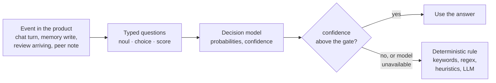
```mermaid
flowchart LR
    EV["Event in the product<br/>chat turn, memory write,<br/>review arriving, peer note"] --> Q["Typed questions<br/>noul · choice · score"]
    Q --> J["Decision model<br/>probabilities, confidence"]
    J --> G{"confidence<br/>above the gate?"}
    G -->|yes| U["Use the answer"]
    G -->|"no, or model<br/>unavailable"| D["Deterministic rule<br/>keywords, regex,<br/>heuristics, LLM"]
```

Where it is used, and what happens without it:

| Decision | Question | Fallback |
|---|---|---|
| Who answers in the chat | `choice` over the four teammates, plus a `noul` for "this needs several roles" | `@mention`, then keyword routing, then the LLM router |
| How to answer | `noul` "the student is asking for the finished code", `score` of how stuck they are | No extra instruction in the prompt |
| Keep a chat episode in memory | `noul` "will this still be useful in a week" | The record is kept |
| Order of retrieved documents | `score` of relevance per candidate, in one call | Vector order after fusion |
| Which skill a criterion tests | `choice` over the 14 skills, per criterion, one call per review | The keyword classifier |
| Peer review and Friday demo verdicts | `noul` "the note names this bug", "the answer is about this criterion" | The existing LLM-with-quoted-evidence check |

Four properties made this worth wiring in:

- **The answer is inside the enumeration by construction.** The chat router cannot return a fifth teammate, and the skill tagger cannot invent a fifteenth skill. That removes a whole class of parsing and validation code.
- **One call, several decisions.** A chat turn asks four questions at once: who speaks, is this a huddle, is the student asking for the answer, how stuck are they. Routing and teaching tone come out of the same request.
- **Probabilities are usable numbers.** The skill tagger's top two probabilities become the weights of the observation that reaches the knowledge model, so an ambiguous criterion contributes to two skills instead of being forced into one.
- **A prompt injection cannot move a verdict.** The peer-review note is data in the state, not an instruction: the answer can only be a probability of yes.

Every call site keeps its old path. The client returns an empty answer instead of raising, on a timeout, a 4xx, a malformed body or an answer below the confidence gate, and after three failures in a row it stops calling for a minute so a bad key does not add latency to every request. With `AGENT_SERVICE_JEV_ENABLED=false` and `SUBMISSION_SERVICE_JEV_ENABLED=false`, which is the default, the product behaves exactly as it did before.

The code: [`decisions/questions.py`](agent_service/app/application/decisions/questions.py) is the typed-question layer, [`decisions/policies.py`](agent_service/app/application/decisions/policies.py) holds the question sets and the thresholds, and [`infrastructure/decisions/jev_client.py`](agent_service/app/infrastructure/decisions/jev_client.py) is the client.

**This is engineering, not a result.** I have no accuracy numbers for the decision model against human labels, so nothing in the evaluation section depends on it being switched on.

## Running the code

Until recently a student wrote code and never saw it run. The only feedback was a language model's opinion, and the only way to get it was to spend one of two attempts. A task can now carry **hidden tests**: pytest written by whoever wrote the task, stored with it, never shown to the student.

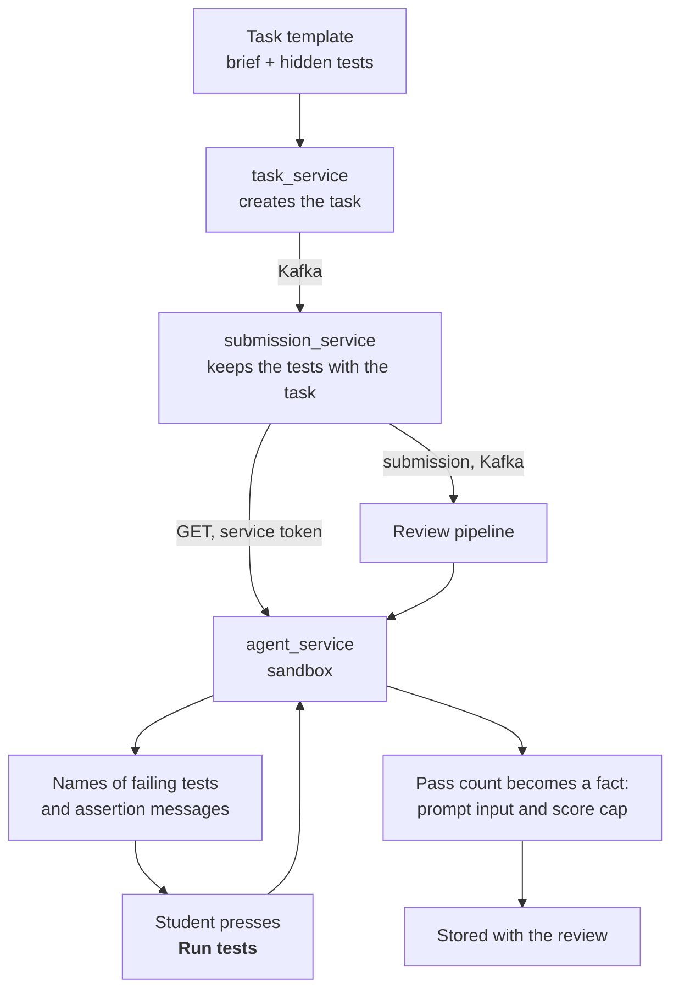
```mermaid
flowchart TB
    A["Task template<br/>brief + hidden tests"] --> B["task_service<br/>creates the task"]
    B -->|Kafka| C["submission_service<br/>keeps the tests with the task"]
    C -->|"GET, service token"| D["agent_service<br/>sandbox"]
    S["Student presses<br/><b>Run tests</b>"] --> D
    D --> R1["Names of failing tests<br/>and assertion messages"]
    C -->|"submission, Kafka"| E["Review pipeline"]
    E --> D
    D --> R2["Pass count becomes a fact:<br/>prompt input and score cap"]
    R2 --> F["Stored with the review"]
    R1 --> S
```

**Before submitting.** The editor has a Run button. It costs nothing: no attempt is spent, no submission is created. The result is the list of failing test names with their assertion messages, never the test code. Two guards keep the button cheap: one run per student at a time (a Redis lock with a short TTL) and a time limit on the run itself.

**During review.** The same tests run inside the pipeline, and their result enters the prompt as a fact rather than an opinion: *"tests passed 1 of 3, failing: test_empty_list, test_limit"*. The reviewer is told plainly that the code was executed, so it cannot claim a working solution is broken, or the other way round.

**The result caps the score.** While any task test is red there is no pass: the ceiling is 7, one below the 8 that counts as a pass on the board, and inside that range it follows the share of passing tests on the same scale the rubric uses (`1 + 9 × share`). Code that does not import at all caps at 2, a run that times out at 3. A fully green run sets no ceiling: tests check behaviour, not structure, naming or the edge cases nobody wrote a test for, and the review can still mark those down.

**What this gives the project.** Every reviewed submission now stores both a model's verdict and an execution result, so the agreement between them is measurable:

```
GET /submission/v1/internal/review-agreement
```

It returns the 2×2 table, the raw agreement, Cohen's κ, and the two mistakes counted apart, because they cost different things. A **false pass** (score ≥ 8, tests red) sends broken code onward. A **false fail** (score < 8, tests green) marks down work that runs. The arithmetic is in [`evaluation/agreement.py`](submission_service/app/application/evaluation/agreement.py) and is covered by unit tests; I have no numbers from real use yet, because nothing has run with real students.

This is not a measure of how good the review is. Tests are a narrow yardstick: they say nothing about readability, structure or the cases their author forgot. What they give is the first signal about this system that does not come from a language model.

**Sandboxing, honestly.** The runner is a subprocess in a temporary directory with limits on CPU, memory, process count and file size, a scrubbed environment and a timeout; the tests and the solution are two files, and only the pytest JUnit report is read back. It is not container isolation, and the project should not run untrusted code from the open internet in this form. Running tests *written by the student* stays off by default and cannot be switched on in a production environment; running the *task's own* tests is on by default, because without it the feature does not exist.

## Review in the code, not beside it

A review used to live on its own page: a score, a list of criteria, a paragraph of feedback. The student read it in one window and looked for the place it meant in another. Remarks now carry an address.

Every failed criterion and every objection from the adversarial reviewer is anchored to a line of the submitted code, and the editor underlines it where it happened. Hovering shows the remark; the report lists the same remarks with their line numbers; clicking one scrolls the editor to it.

**Where the line comes from.** Four sources, in descending order of trust: the line the grading model returns for a criterion (validated against the length of the code it was given); an explicit mention in the remark's own text (*«строка 12»*, `line 12`, `file.py:12:`); a snippet in backticks or quotes found verbatim in the code; or a function, class or variable name from the remark, resolved to its declaration, else its first use. If none of them fires, the remark keeps no line and stays in the report as before. The rule the anchoring follows is *no anchor beats a wrong anchor*: a highlight on the wrong line sends the student away from the bug, which is worse than no highlight at all. Quoted Russian prose is not treated as a code snippet, and common words (`return`, `class`, `error`) are never addresses.

**The highlight expires honestly.** Lines belong to the code that was submitted. The moment the student edits the file, the anchors no longer describe what is on screen, so the underlines disappear. Nothing silently points at the wrong place.

**And the previous attempt is one click away.** A second attempt can be compared with the first in the same editor — Monaco's inline diff, read-only, with no page change. Seeing *what I actually changed* next to *what the review asked for* is the comparison a second attempt is about.


The code: [`review/anchor.py`](agent_service/app/application/review/anchor.py) decides the line, [`review-marks.ts`](frontend/src/lib/review-marks.ts) turns a review into editor markers.

## Where the tasks come from

Hidden tests make a task worth more and cost more to write. Writing them by hand is what ran out first, so the admin panel can ask a model for a draft — but nothing is published on the model's word. The server runs the same checks I used to run by hand, and the admin sees the verdicts before anything is saved.

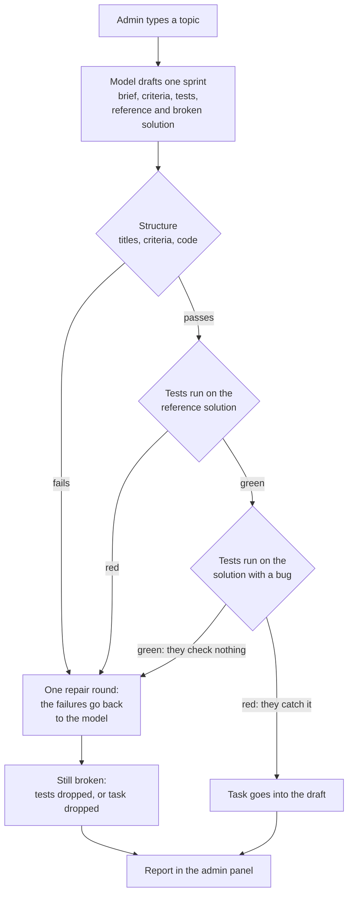
```mermaid
flowchart TB
    A["Admin types a topic"] --> B["Model drafts one sprint<br/>brief, criteria, tests,<br/>reference and broken solution"]
    B --> C{"Structure<br/>titles, criteria, code"}
    C -->|fails| R["One repair round:<br/>the failures go back<br/>to the model"]
    C -->|passes| D{"Tests run on the<br/>reference solution"}
    D -->|red| R
    D -->|green| E{"Tests run on the<br/>solution with a bug"}
    E -->|green: they check nothing| R
    E -->|red: they catch it| F["Task goes into the draft"]
    R --> G["Still broken:<br/>tests dropped, or task dropped"]
    G --> H["Report in the admin panel"]
    F --> H
```

**What is checked.** Structure first, because it is free: the title is unique, short and not one the career layer reserves; the brief is long enough and carries a *Критерии приёмки* block with three to six criteria, since that block is what the review rubric reads; any Python in the brief parses; and the brief says nothing about the board, sprints or grades, which are the product's rules and not the task's. Then the test file, still as text: pytest, the solution imported from `solution`, at least three tests, real assertions, and nothing that needs the network, a clock or input, because the sandbox has none of them.

**Then it is executed, twice.** The model is asked for two solutions it never shows the student: the reference, which must pass every test, and the same code with a typical junior bug, which must fail at least one. The second run is the one that matters. A test suite that stays green on broken code is not a weak suite, it is a broken instrument, and nothing in the text of a test reveals that — only running it does.

**What happens to a task that fails.** The failures are sent back to the model once (`AGENT_SERVICE_TEMPLATES_MAX_REPAIR_ROUNDS`, default 1). If what remains is only about the tests, the task is published without them: a task with no tests behaves exactly as before, and that is a smaller loss than publishing tests that lie. If the brief itself is broken, the task is dropped. Both outcomes are named in the panel, task by task, with the numbers: *tests 8/8 on the reference, the bug is caught by 3 of them*.

Generation goes one sprint per request, which keeps the model's answer short enough to parse reliably, shows progress while it works, and fits inside the gateway's timeout. The draft lands in the same JSON field an admin would have filled in by hand, so it can be edited before it is created.

**The same checks without a model.** A template from anywhere — the generator, the panel, another repository — can be checked from the terminal:

```bash
python -m agent_service.app.application.templates.cli template.json --run
```

Without `--run` it is text analysis. With it, every test file is run against an *empty* solution and must fail: the published template carries no reference solution, so this is the one execution check left, and it still catches the worst case. The hand-written template in this repository passes both.

**What this does not do.** The checks are mechanical. They can tell that a task is well-formed, that its tests run and that they discriminate; they cannot tell whether the task is worth solving, whether the difficulty grows sensibly across the sprints, or whether the brief is written in a voice a student will read. A human still reads the draft before it is published — that is why the panel shows it rather than creating the template itself. And the quality of generated tasks against hand-written ones is unmeasured; I have no study, only the checks.

## The learning trajectory

An earlier version of this was a hand-weighted formula over four numbers. It could say that a student was doing poorly, but not at what. I replaced it with a model of individual skills.

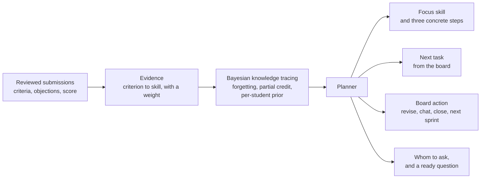
```mermaid
flowchart LR
    S["Reviewed submissions<br/>criteria, objections, score"] --> E["Evidence<br/>criterion to skill, with a weight"]
    E --> B["Bayesian knowledge tracing<br/>forgetting, partial credit,<br/>per-student prior"]
    B --> P["Planner"]
    P --> F["Focus skill<br/>and three concrete steps"]
    P --> N["Next task<br/>from the board"]
    P --> A["Board action<br/>revise, chat, close, next sprint"]
    P --> Q["Whom to ask,<br/>and a ready question"]
```

**Skills and evidence.** There are 14 skills (edge cases, validation, error handling, testing, algorithms, data structures, API design, storage, concurrency, security, and so on). Every criterion in a review is one pass/fail observation against one or two of them. Objections from the adversarial reviewer count as weaker negative evidence, weighted by severity. The final score is used only when a review has no criteria.

The mapping from a criterion to skills is the weakest link in this chain, so it is computed once, when the review arrives, and stored next to the submission. A keyword classifier over word stems does it by default. When the decision model is enabled, a `choice` question per criterion does it instead, and the two top probabilities become the weights of the observation, so an ambiguous criterion splits 0.6 / 0.4 between two skills instead of landing entirely in one. Criteria the model is not confident about fall back to keywords, so a trajectory stays reproducible either way.

**The model.** Each skill has a probability `P` that the student knows it. One submission updates it in three steps:

```
1. forget   P <- P0 + (P - P0) * 2^(-dt / h)      h doubles after a success on a different day,
                                                  halves after a failure
2. observe  Bayes update over all observations of the submission,
            each weighted by its reliability (a tempered likelihood)
3. learn    P <- P + (1 - P) * T                  once per submission, not once per criterion
```

The prior `P0` for a skill the student has not met yet comes from how they did on other skills, so a strong student does not start every new skill at the population mean.

**Parameters without data.** I have no logs of real students, so I did not fit `(P0, T, slip, guess)`. I wrote seven behavioural requirements instead. Examples: one clean submission must already predict a pass, two in a row must not count as mastery, three in a row must, and a failure after three successes should be read as a slip rather than a gap. A grid search then picked the values with the largest smallest margin across all seven: `(0.30, 0.30, 0.05, 0.30)`. The readiness threshold is not tuned either. The review scale gives `score = 1 + round(9 * pass rate)`, so a score of 8 needs a pass rate of 0.722, and that is the bar.

**It can only suggest what the board will actually open.** The planner used to rank every open task by expected gain, while the board hands out tasks in order until Junior+. A student could be told to take a task and then find it locked. The planner now mirrors the board's own rules: a task already in progress is the only next step, nothing new opens while something waits for review, below Junior+ the queue decides, and the optional night incident never blocks the queue. The grade right travels as one request flag (`can_pick_task`); it only widens what may be *suggested*, while access to a task and the close gate stay with `task_service`. Queue position and task title reach the trajectory through the same Kafka events that already carried status and brief.

**What it decides.** It separates a gap from a slip by computing `P(knows | failed)`. A gap sends the student to the right teammate with a ready-made question; a slip means "check your code again". It picks a focus skill in a fixed order: unmet criteria of the current task, then a skill that is fading, then the skill where one more task gains the most, then something harder. The next task from the board maximises the expected realised gain, `(1 - P) * T * P_success`. This is the zone of proximal development written as a formula, without an extra tuning constant.

**Evidence, and how far it goes.** I generated 200 synthetic students over 24 tasks each, 10 seeds. The generator is an Additive Factors Model with forgetting, so it is deliberately not the model being tested. The task is to predict each criterion before it is graded.

| Predictor | AUC | Log loss |
|---|---|---|
| The earlier hand-weighted formula | 0.643 ± 0.017 | 0.709 ± 0.024 |
| Success rate of the whole student | 0.663 ± 0.013 | 0.638 ± 0.027 |
| Success rate per skill | 0.685 ± 0.024 | 0.629 ± 0.021 |
| BKT without forgetting | 0.687 ± 0.015 | 0.651 ± 0.031 |
| **BKT with forgetting (this model)** | **0.689 ± 0.013** | **0.627 ± 0.027** |

It is clearly better than the formula it replaced and matches a strong per-skill baseline on prediction. The difference in what it can do shows up elsewhere. Asked to name the student's weakest skill, it is right 32% of the time, against 15% for a random pick and 13% for "the skill they failed last". Both results depend on the simulator's assumptions. They show the model behaves sensibly, not that it helps real students.

## Five-minute repetition

The knowledge model has always known that skills decay: each one carries a half-life, and when retention falls below the target the skill is marked *fading*. Until now that only produced advice — "refresh this topic" — and the only thing a student could actually do about it was take another half-day task. Advice without an action is a to-do list.

A fading skill now comes with a **drill**: one function, three to five hidden tests, five minutes.

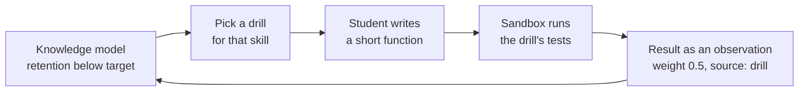
```mermaid
flowchart LR
    K["Knowledge model<br/>retention below target"] --> P["Pick a drill<br/>for that skill"]
    P --> S["Student writes<br/>a short function"]
    S --> R["Sandbox runs<br/>the drill's tests"]
    R --> O["Result as an observation<br/>weight 0.5, source: drill"]
    O --> K
```

**The loop closes in the model, not in a checkbox.** A drill run is reported by the sandbox — not by the browser — and enters the same Bayesian update as a reviewed criterion, at half the weight, because a drill is narrow and its wording hints at the answer. What it does carry fully is the *practice event*: the last-practised timestamp moves to now, so retention resets, and a success on a day different from the last one doubles the half-life. That is spaced repetition expressed in the model the project already had, rather than a second scheduler bolted beside it.

**When a drill appears.** Only when some skill is actually fading, or (after those) when one is still a gap. Not on a timer, not once a week. The same skill is not offered twice within twenty hours, and drills rotate inside a skill, so a student who comes back daily gets a different one. Most days there is nothing to show, and the card simply is not there.

**What a drill looks like.** The nineteen drills in [`drills/bank.py`](submission_service/app/application/drills/bank.py) cover all 14 skills. They are small but not toy: *catch exactly the exception you meant* (`except Exception` hides other people's bugs), *merge overlapping intervals*, *do not let a token reach the log line*, *write the test cases that catch a rounding bug*, *insert a row with parameters rather than string concatenation*, *make the requests run at the same time* — the concurrency drill's third test enters a barrier, so a sequential solution hangs and times out rather than passing by accident.

Drills are checked the same way generated tasks are: every drill's tests must pass on the author's reference solution and fail on the stub the student starts from. That check runs in the service's own test suite, so a drill that stops discriminating fails CI rather than quietly rubber-stamping whoever opens it.

A drill costs no attempt, creates no submission and changes no score on the board. The only thing it moves is the forgetting curve.

## The team chat

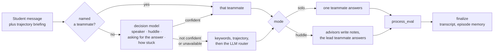
```mermaid
flowchart LR
    Q["Student message<br/>plus trajectory briefing"] --> M{"named<br/>a teammate?"}
    M -->|yes| D["that teammate"]
    M -->|no| J["decision model<br/>speaker · huddle ·<br/>asking for the answer ·<br/>how stuck"]
    J -->|confident| D
    J -->|"not confident<br/>or unavailable"| K["keywords, trajectory,<br/>then the LLM router"]
    K --> MODE{"mode"}
    D --> MODE
    MODE -->|solo| SO["one teammate answers"]
    MODE -->|huddle| H["advisors write notes,<br/>the lead teammate answers"]
    SO --> PE["process_eval"]
    H --> PE
    PE --> FIN["finalize<br/>transcript, episode memory"]
```

Sara (product), Mike (analytics), Emma (QA) and John (tech lead) each have a persona and a focus area. Emma retrieves from the bug-pattern notes, the others from the best-practice notes. A message that touches two areas becomes a huddle led by John. When the trajectory says the student should talk something through, the reply comes from the teammate who owns the weak skill, and the input box is prefilled with a ready question.

Naming a teammate always wins. Otherwise one decision call answers four questions about the turn, and two of them never reach the router: whether the student is asking for the finished code, and how stuck they are. Those become instructions to the teammate who answers: hold back the patch and name the place in their code, or slow down to one step and start from what already works. Asking for help and asking for the answer are different requests, and the second one deserves a different reply, not a refusal.

## The team writes first

The chat waited for a question. People who are stuck do not ask one — that is what being stuck looks like. Two situations are visible in the submissions themselves:

- **a repeat**: the second attempt at a task is, to the whitespace and comments, the same program as the first. The remark did not land, and the next attempt will burn the same way;
- **silence**: a review refused the work, and for hours nothing follows — no edit, no question, no new submission.

`submission_service` computes the signal from stored submissions (deterministically, with a similarity measure that ignores formatting and comments) and publishes it on the trajectory. `agent_service` decides whether to act on it, and Emma — the teammate who owns quality — writes a short message that lands in the team chat, where the student can simply answer.

Three brakes keep this from becoming a mailing list:

1. the signal is one of exactly two, computed from facts, not a timer;
2. the decision model answers a different question — *will a message help right now, or only annoy* — and can hold it back; with the model off, or an answer below the confidence gate, the message goes out, because silence by default is the worse failure;
3. the same reason never fires twice: a mark in Redis lives for a day.

The text comes from the language model, with a deterministic fallback that names the task and the first unmet criterion, so a missing API key means a plainer message rather than no message.

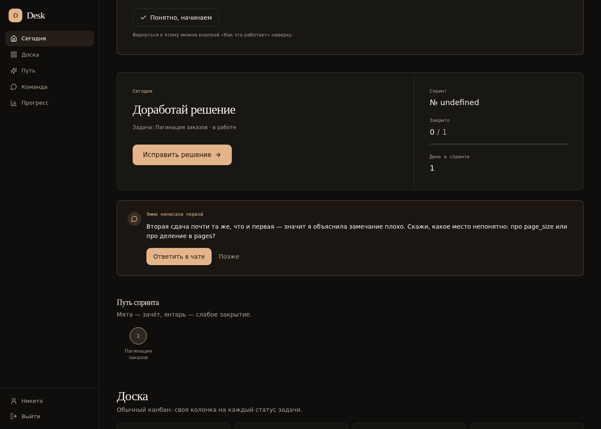

The code: [`trajectory/nudge.py`](submission_service/app/application/trajectory/nudge.py) finds the signal, [`use_cases/proactive_nudge.py`](agent_service/app/application/use_cases/proactive_nudge.py) decides and writes.

## The career layer

| Grade | Salary (simulated, RUB) | What changes |
|---|---|---|
| Intern | 70,000 | One teammate per chat turn. Acceptance criteria are shown after the first submission |
| Junior | 110,000 | The brief as written |
| Junior+ | 150,000 | Criteria are visible up front. The student picks which task to start. A peer-review task appears |
| Strong | 190,000 | The brief loses its step-by-step plan. One appeal per sprint |
| Offer | 240,000 | As Strong, and the student chooses the next project's direction and can reopen old letters |

What is shown by grade is decided in the client (`frontend/src/lib/career-rights.ts`), not enforced by the API.

- **Sprint end.** When the tasks are done, the student gives a Friday demo (a two to four sentence pitch and one question). Then a letter arrives from the tech lead. It is a promotion (next grade, plus a bonus of 20% of the new salary, halved if the pitch was weak), no raise (most tasks were closed weakly), or a freeze (the trajectory is thin). A thin trajectory freezes the raise; it does not block the next sprint. If the trajectory service cannot be reached, completion is held.
- **Bonus.** It can be spent during the next sprint on an extra review round, a one-turn session with Emma, or criteria before submitting. Whatever is left is replaced by the bonus in the next letter.
- **Night incident.** An optional task that arrives as a message from Emma: production is returning 500. A full pass adds a one-off bonus to the letter.
- **Peer review.** From Junior+, the student reads a snippet generated by the LLM with one planted bug and writes down what is wrong. The generator is checked so the bug text does not leak into the code, and a fixed snippet is used if generation fails. The verdict is a typed decision; the LLM only writes Emma's line once the verdict is in.

**The short loop.** A grade arrives once a sprint, which is too rare to tell a student they are getting somewhere. Eleven badges fill the gap: first pass, closed without a second attempt, a 9 or a 10, three and five passes in a row, the planted bug found, the night incident closed, a pitch that held, a promotion, a bonus spent on help, three sprints. Each one is a counter reaching a target, so the same pair produces the goals shown next to the shelf: what is left, and how far along it is. Counters move only on closed work (a pass on the board, a sprint accepted), never on time spent in the editor or pages opened. The award is computed from stored state rather than from an event log, so a badge cannot be won twice and the whole shelf can be recomputed. Awards come back in the response of the request that earned them, and the client shows the card on whatever screen the student is on.

## Memory

| What | Where | Access |
|---|---|---|
| **What is true about the student** | Neo4j, one subgraph per student, facts with a validity window | Hybrid search over edges, filtered to the open window |
| Best practices, bug patterns | ChromaDB, semantic layer, from Markdown files in `agent_service/app/infrastructure/knowledge` | Vector search |
| Past reviews, chat episodes | ChromaDB, episodic layer, with age limits and recency weighting | Vector search, scoped by user |
| Student profile | MongoDB, one document per student — a projection of the graph | Direct read by `user_id` |
| Episodes awaiting ingest | MongoDB, durable outbox | Claimed in batches under a lease |
| Chat transcripts | MongoDB, thread per user and task | Direct read |
| Review and chat run state | Redis (LangGraph checkpoints, with a TTL) | By thread id |
| Retrieval cache | Redis | By query |

### A temporal knowledge graph of the student

The vector layers answer "what looks like this". They cannot answer the question a mentor actually asks: *what is true about this student now, what used to be true, and what is it based on?* A flat profile cannot either — it is overwritten whole, with no time, no links and no provenance.

So the facts about a student live in a temporal knowledge graph ([Graphiti](https://github.com/getzep/graphiti) over Neo4j), and the flat profile became a projection of it. Four decisions carry the design.

**Skill nodes are fixed, not invented.** A graph whose entities are named by a language model fills up with synonyms: "error handling", "exceptions" and "bare except" become three nodes about one thing, and no query ever brings them back together. Here the skill vocabulary is closed and is the same fourteen skills the knowledge-tracing model uses. An extracted fact either resolves to one of them or does not enter the graph at all. Losing a fact is annoying; an unnamed node is worse, because nothing can ever find it. The payoff is that the qualitative model (the graph) and the quantitative one (BKT) talk about the same objects and can be reconciled against each other.

**Facts have two timelines.** Each edge carries `valid_at` — when it became true in the world, which is the moment of the submission, not the moment the background worker got around to it — and `invalid_at`, which is null while the fact holds. A contradicted fact is closed, never deleted. That is what makes both questions answerable: "what holds now" and "how did this skill change", and it is why a student is not reminded of a habit they have already dropped.

**Sources are ordered, and the order is enforced in the domain.** A fact is tagged `hidden_tests`, `review`, `trajectory` or `chat`, and a fact may only close another one if its source is no weaker. Without that rule, writing "I always handle errors now" in the chat is enough to erase what execution showed — and an extraction model will happily take such a sentence as a fact, because it is phrased as one. The ceiling on confidence works the same way: words are never "certainly so".

**Deciding and phrasing are separate jobs.** The usual agentic-memory design lets one model decide what to keep and write it as prose, which both hoards junk and makes the result irreproducible. Here the language model phrases a fact but does not rule on it; the decision model picks an operation — add, reinforce, invalidate, skip — from an enumeration defined in code, returning probabilities rather than text, so it cannot invent a fifth one; and the domain checks that the chosen operation is allowed under the trust order. The last step matters more than it looks: the gate can confidently say "invalidate" because the student was convincing, and the domain still refuses. A typed choice narrows the answer space; it does not make the answer right.

Everything a rule can derive is derived by code and never reaches a model: a failed acceptance criterion is a skill gap, a failed hidden test is a skill gap with the strongest source, a passing criterion under green tests is positive evidence. An error pattern is closed deterministically when the hidden tests pass and no criterion for its skill failed — so execution, not an opinion, is what clears a student's record.

Writes never block a student. An episode goes into a durable outbox in MongoDB and is processed by a background worker; enqueueing is idempotent, so a redelivered event cannot double a fact.

**Consolidation runs between sessions**, not per episode. It does four things and nothing else: a mistake seen three times becomes chronic and keeps its weight; everything else decays on a half-life per relation and closes below a floor; the graph is reconciled against the knowledge-tracing estimate, where the trajectory may overrule a review verdict but never an execution result; and near-duplicate error patterns merge. The plan is computed by pure functions, so the whole thing is tested without a database.

The graph is optional and is deliberately **not** part of the readiness probe. Every call is bounded by a timeout, the adapter never raises, and when the graph is off, unreachable or still empty, reads fall back to the projected profile — which is exactly the behaviour that existed before the graph. There is also an explicit erasure path: a closed window is still personal data, so `DELETE /memory/me` drops the whole subgraph rather than marking it.

### Keeping the vector layers clean

Four rules keep them from turning into a landfill:

- **Ownership is a filter in the store, not a filter after the search.** Private types carry a `user_id`, and it goes into the Chroma `where` clause for the episodic layer. Before, another student's documents could take up half of the top-k and be dropped afterwards, which cost recall for the student who was actually asking. Shared knowledge has no owner, so the filter is only applied when every requested type is private.
- **A repeat merges instead of piling up.** Before writing, a near-duplicate of the same type and owner is looked up by cosine distance. If one is there, the new text replaces it under the same id, the first-seen date and the use counter survive, and the timestamp is refreshed, so a confirmed observation becomes fresh again. That is the forgetting curve of the trajectory model pointed the other way.
- **Use is a signal.** Documents that actually reach a prompt get a use counter. Ranking weight is freshness plus a bounded bonus that grows as `uses / (uses + 3)`, so the third use adds half of what the bonus can ever give and the hundredth adds almost nothing. Memory decays with time and strengthens with use.
- **Writes are gated.** Text is compressed, empty or filler text and pasted solutions are rejected, personal records need a user id, and when the decision model is on, a chat episode has to pass "will this still be useful in a week". Retrieved documents are reranked by a relevance score per candidate; anything the model confidently calls off-topic is dropped before the prompt is built. Both gates fail open.

## Testing and evaluation

- **562 unit tests** (`submission_service` 128, `task_service` 110, `agent_service` 324). They cover the scorecard and its caps, the close gate, the knowledge model, the planner, memory rules (ownership filters, merging, reinforcement, both gates), checkpoint round trips, routing, the typed-question layer and its client, the badge rules, and the career rules. The decision model is tested against recorded request and response shapes, including a timeout, a 429, a malformed body, an option outside the enumeration, and the cooldown after repeated failures.
- **The knowledge graph is tested without a database.** The ontology, the trust order, the gates, the consolidation plan and the projection are pure functions, so 94 tests cover them directly: that a bare-except claim written in Russian cannot become an English slug, that a chat sentence cannot close what execution recorded, that the decision model's "invalidate" is refused when its source is weaker, that a faded fact is closed rather than deleted, that the knowledge-tracing estimate may overrule a review verdict but not a test result. The Neo4j adapter is tested against a fake client for the shape of what it writes, the filters it sends and the fact that it returns empty instead of raising when the graph is down.
- **Execution is tested against real pytest output.** The hidden-test runner is exercised end to end on a working solution, on a broken one, on code that does not import and on a run that times out, with the JUnit report parsed in each case; the score caps are checked against the pass threshold. The agreement arithmetic is tested on hand-built tables, including perfect agreement, chance-level agreement, and the two kinds of mistake counted apart.
- **The agreement metric** is served by `GET /submission/v1/internal/review-agreement` over stored reviews, as described above. It needs submissions to exist, so there are no numbers in this repository.
- **Anchoring is tested for restraint, not just for hits.** The line-finding tests cover each source (model, text, snippet, symbol) and, as importantly, the cases that must stay unanchored: prose in quotes, common keywords, a remark with nothing to hold on to, and a line number outside the submitted code.
- **The proactive message is tested at every brake.** A repeat and a silence produce a message; a passing review, a fresh failure and a week-old one do not; the same reason never fires twice; the decision model can hold a message back, and an empty answer from it cannot; a missing or broken language model still produces human text.
- **Every drill is verified by running it.** Each of the nineteen drills is executed twice in the suite: its tests must pass on the author's reference solution and fail on the stub the student starts from. A drill that stops discriminating fails the build.
- **The template checks are tested on real pytest runs too.** The generator is driven by a fake model, so the tests are about the checks rather than about the model: a draft whose tests pass on the broken solution loses its tests, a draft whose brief is malformed is dropped, a failing reference solution is sent back for one repair round, and the published payload is asserted to carry no reference solution. One case runs the whole thing through the real sandbox.
- **Offline eval harness** in [`agent_service/evals`](agent_service/evals). It runs the deterministic part of the pipeline (tools, rubric, caps) with no LLM and checks the expected caps, and can run a small set of LLM-backed review and chat cases against a running stack. The dataset is small: 5 review cases and 5 chat cases. It is a regression net.
- **Simulation** of the trajectory model, as above: `python -m submission_service.app.application.trajectory.simulation`.
- **Load scenario** for the gateway in [`tests/locust`](tests/locust). I have no results to publish.

## Observability and deployment

- **Telemetry.** Services export OpenTelemetry traces to Tempo, logs go through Promtail to Loki, metrics go to Prometheus with Alertmanager, and Grafana ships with provisioned dashboards. Each graph node is a span. LLM calls can be traced in Langfuse (off by default).
- **Compose.** `docker-compose.yml` starts the services, the client, Kafka, Neo4j and the observability stack.
- **Kubernetes.** Helm charts for each service and an umbrella chart (`charts/`). MongoDB, Valkey and Neo4j run as workloads under `gitops/manifests/workloads/infrastructure/`; the graph is deliberately left out of the readiness probe, so a Neo4j outage does not take agent pods out of rotation. Argo CD applications, Istio, Cilium, an HAProxy and Keepalived edge, external-secrets against Vault, and kube-prometheus-stack are described under `gitops/`. Terraform bootstraps namespaces and base secrets (`infra/`), and an Ansible role installs Kafka with Strimzi (`ansible/`).
- **CI.** A GitHub Actions workflow on a self-hosted runner builds the images with Kaniko, commits the new image tag to the Helm values, and triggers an Argo CD sync when credentials are configured.

These are deployment definitions. I have not run them at scale.

## Running it

You need Docker, a MongoDB and a Redis reachable from the containers (the compose file does not start them), and an API key for an OpenAI-compatible endpoint. Neo4j is in the compose file and is only needed if you switch the knowledge graph on.

```bash
cp docs/.env.example .env      # fill in hosts, secrets and the LLM settings
docker compose up --build
```

The decision model is optional. To switch it on, set `AGENT_SERVICE_JEV_ENABLED` and `SUBMISSION_SERVICE_JEV_ENABLED` to `true` and put an OpenRouter key in `*_JEV_API_KEY`; without them every decision takes its deterministic path.

The knowledge graph is optional too and off by default. `docker compose up neo4j` starts it (Bolt on 7687, browser on 7474); set `AGENT_SERVICE_GRAPH_MEMORY_ENABLED=true` and `AGENT_SERVICE_NEO4J_PASSWORD` to switch it on. With it off, or with Neo4j unreachable, the team reads the projected profile instead and the service behaves exactly as it did before the graph. `AGENT_SERVICE_GRAPH_MEMORY_EXTRACTION_MODEL` can point the background extraction at a cheaper model, and `AGENT_SERVICE_GRAPH_MEMORY_MODEL_EXTRACTION_ENABLED=false` keeps only the facts that rules derive from tests and criteria.

The template generator in the admin panel is on by default and needs no extra key beyond the LLM one; `AGENT_SERVICE_TEMPLATES_ENABLED=false` switches the endpoint off, `AGENT_SERVICE_TEMPLATES_MAX_REPAIR_ROUNDS` is how many times a rejected task goes back to the model, and `AGENT_SERVICE_USER_URL` is the user_service the role check goes to.

Task tests need one shared secret, because the sandbox fetches them service to service: put the same value in `SUBMISSION_SERVICE_INTERNAL_TOKEN` and `AGENT_SERVICE_SUBMISSION_INTERNAL_TOKEN`. Without it the internal endpoints answer 503, the Run button reports that the task has no tests, and review falls back to the language model alone. `AGENT_SERVICE_SANDBOX_RUN_HIDDEN_TESTS` (default `true`) turns execution off entirely, and `AGENT_SERVICE_HIDDEN_TESTS_TIMEOUT_SEC` (default 20) is the limit on one run.

| URL | What |
|---|---|
| http://localhost:3000 | Client |
| http://localhost:8005 | API gateway |
| http://localhost:3001 | Grafana |
| http://localhost:4000 | Langfuse |

The repository ships the platform, not a curriculum. There is no seed data, so before the first login:

1. Register a user in the client.
2. In MongoDB, insert `{ "user_id": <your id>, "role": "superadmin" }` into the `admins` collection of the user database. There is no bootstrap command for this yet.
3. Open the admin panel and create a project template. Sprints are entered as JSON; the panel starts with an example.

**Tests.** The services read their settings when the code is imported, so the environment must be filled in even for unit tests. They do not connect to anything, so any values will do:

```bash
python -m venv .venv && source .venv/bin/activate
pip install -r submission_service/requirements.txt -r task_service/requirements.txt \
            -r agent_service/requirements.txt pytest

set -a; source <(sed -E 's/=$/=1/' docs/.env.example); set +a
pytest submission_service/tests task_service/tests agent_service/tests
```

Python 3.12 is what the images use.

## Limitations

- **No study with real students.** I do not know whether this improves learning. The trajectory results come from simulation, and their assumptions are the simulator's.
- **The skill map is unvalidated.** Criteria are assigned to skills by keyword patterns over word stems, or by the decision model when it is enabled. Neither has been checked against human labels, and a wrong assignment feeds straight into the knowledge model.
- **The decision model is unmeasured.** Switching it on changes routing, what is remembered and how criteria are tagged. I know it fails safely, because every call site keeps its old path behind a confidence gate; I do not know how often it is right. Measuring it needs the same labelled sample as the skill classifier.
- **The parameters are derived, not fitted.** With real logs they should be estimated (EM, or a grid search on likelihood), and the seven constraints are a good sanity check for the result.
- **LLM grades vary.** The caps make scores more predictable, not more valid. Execution gives the first external check on them, and the endpoint above reports it, but tests are a narrow yardstick: a green run says the behaviour the task's author thought to test is right, not that the code is good. Agreement with human graders is still unmeasured, and that is the comparison that would settle the question.
- **Anchoring is heuristics, not analysis.** The line a remark points at comes from a model's answer or from text matching, not from parsing the code and resolving what the remark refers to. It is deliberately conservative — it leaves remarks unanchored rather than guessing — but a plausible wrong anchor is still possible, and I have not measured how often.
- **Writing first is unmeasured too.** Whether a message after a repeated submission actually helps, or just interrupts, is exactly the kind of question a cohort would answer and a simulation would not.
- **The sandbox is process-level.** A subprocess with resource limits and a scrubbed environment is fine for a prototype and would need containers before untrusted use. Running student-written tests stays off because of it.
- **Few tasks have tests.** A task without them behaves exactly as before: no Run button, no cap, no ground-truth label. The generator makes writing them cheaper, not automatic.
- **Generated tasks are unmeasured.** The checks say a task is well-formed and that its tests discriminate. Nothing says a generated task teaches as well as a hand-written one, or that the sprints grow in difficulty the way a curriculum should. That comparison needs the same cohort the rest of the evaluation needs.
- **The knowledge graph has not met a student.** Its rules are covered by tests and it behaves on synthetic episodes, but nothing says how much of what an extraction model writes about a real submission is worth keeping.
- **Extraction across languages is unmeasured.** The student writes in Russian, the facts are stored in English, and what that translation step loses is exactly the sort of thing that needs measuring rather than assuming.
- **Language and scope.** Prompts, personas and the interface are in Russian. Static analysis covers Python and JavaScript only.
- **Little content.** No task corpus, and the eval dataset is small. The first superadmin is created by hand.
- **Grade-dependent hints are client-side.** A determined student can see everything through the API, and `can_pick_task` is advice the client sends about itself. Neither moves the two things that are enforced server-side: which task the board opens and whether a task may be closed.

Things I would do next, in order: collect real submission logs from a small cohort, label a sample of criteria to measure the skill classifier and the reviewer against humans, fit the model parameters, and compare the trajectory against a fixed task order in a classroom trial.

## Where to start reading

| File | What is in it |
|---|---|
| [`review/scorecard.py`](agent_service/app/application/review/scorecard.py) | How the score and the caps are composed |
| [`tools/hidden_tests.py`](agent_service/app/application/tools/hidden_tests.py) | Running a task's tests in the sandbox and reading the JUnit report |
| [`evaluation/agreement.py`](submission_service/app/application/evaluation/agreement.py) | The 2×2 table, κ, and the two kinds of mistake |
| [`templates/checks.py`](agent_service/app/application/templates/checks.py) | Every rule a task has to satisfy before it is published |
| [`drills/bank.py`](submission_service/app/application/drills/bank.py), [`select.py`](submission_service/app/application/drills/select.py) | The drills, and when a fading skill earns one |
| [`review/anchor.py`](agent_service/app/application/review/anchor.py) | How a remark gets a line, and when it does not |
| [`trajectory/nudge.py`](submission_service/app/application/trajectory/nudge.py) | The two signals that make the team write first |
| [`use_cases/generate_project_template.py`](agent_service/app/application/use_cases/generate_project_template.py) | Draft, check, one repair round, drop what is still broken |
| [`graphs/review_graph.py`](agent_service/app/application/graphs/review_graph.py) | The review pipeline as a LangGraph |
| [`review/agent_path.py`](agent_service/app/application/review/agent_path.py) | The process checks on the agents |
| [`trajectory/knowledge.py`](submission_service/app/application/trajectory/knowledge.py) | The knowledge model: forgetting, evidence, per-student prior |
| [`trajectory/planner.py`](submission_service/app/application/trajectory/planner.py) | Focus skill, plan, and choice of the next task |
| [`trajectory/calibration.py`](submission_service/app/application/trajectory/calibration.py), [`simulation.py`](submission_service/app/application/trajectory/simulation.py) | Where the parameters and the numbers above come from |
| [`career.py`](task_service/app/application/career.py) | Grades, letters, bonus and their rules |
| [`quests.py`](task_service/app/application/quests.py) | Counters, badges and the goals built from them |
| [`decisions/questions.py`](agent_service/app/application/decisions/questions.py), [`policies.py`](agent_service/app/application/decisions/policies.py) | Typed questions, and every question the product asks |
| [`memory/layered_memory.py`](agent_service/app/infrastructure/memory/layered_memory.py) | Ownership filters, merging, reinforcement, rerank |
| [`graph_memory/ontology.py`](agent_service/app/application/graph_memory/ontology.py) | The closed vocabulary of the knowledge graph |
| [`graph_memory/trust.py`](agent_service/app/application/graph_memory/trust.py) | Source ranking, and what may overturn what |
| [`graph_memory/curator.py`](agent_service/app/application/graph_memory/curator.py) | Rules, then the model, then the gate, then the domain |
| [`graph_memory/consolidation.py`](agent_service/app/application/graph_memory/consolidation.py) | Forgetting, chronic patterns, reconciliation with BKT |

## Repository map

```
api_gateway/          reverse proxy, rate limiting
user_service/         accounts and roles
task_service/         projects, sprints, board, career rules, badges
submission_service/   submissions, review loop, learning trajectory
  app/application/trajectory/   skills, evidence, knowledge model, planner, calibration, simulation
  app/application/drills/       five-minute exercises and when they are offered
  app/application/evaluation/   agreement between the review and the tests
agent_service/        review graph, team chat, memory, evals
  app/application/review/       rubric, scorecard, adversarial check, process check
  app/application/graph_memory/ ontology, trust rules, curator, consolidation
  app/infrastructure/graph_memory/  Neo4j adapter, episode outbox, background workers
  app/application/decisions/    typed questions for the decision model
  app/application/tools/        static analysis and the hidden-test sandbox
  app/application/templates/    task generation and the checks before publishing
  app/application/graphs/       LangGraph definitions
  evals/                        offline evaluation
frontend/             React client
charts/ gitops/ infra/ ansible/   deployment definitions
monitoring/ monitoring_python/    telemetry configuration and FastAPI instrumentation
docs/                 trajectory and memory write-ups, data model, diagrams, env template
```

## Author

Alexandra Kalimullina, [@alexaaa-a](https://github.com/alexaaa-a).
