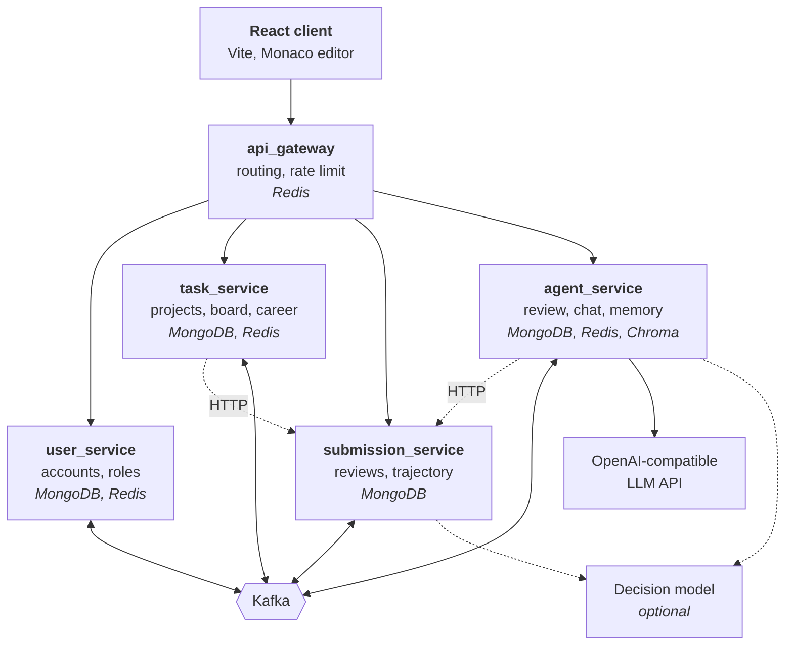
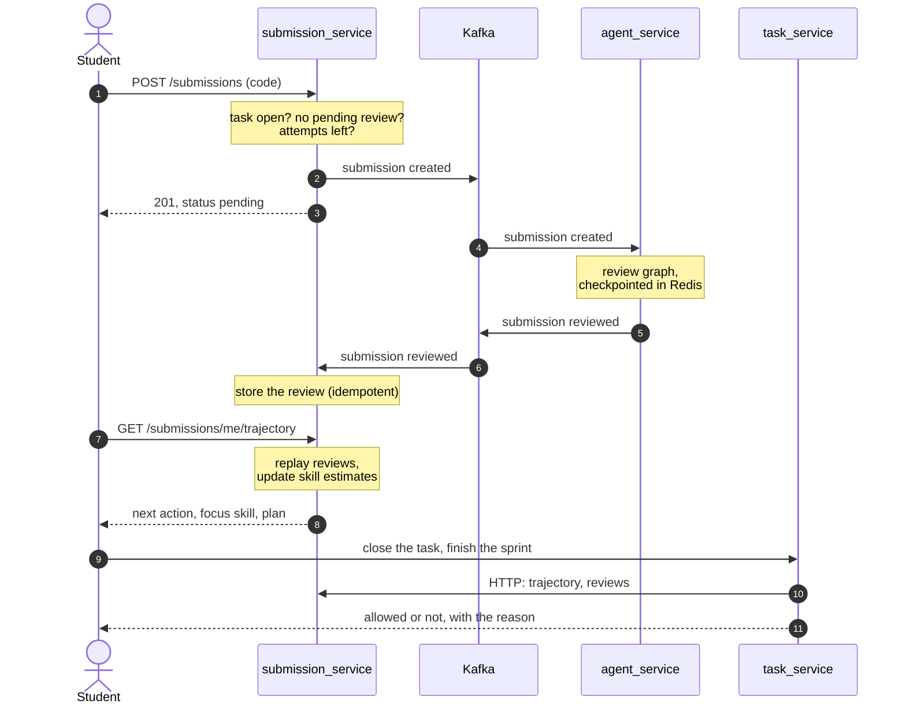
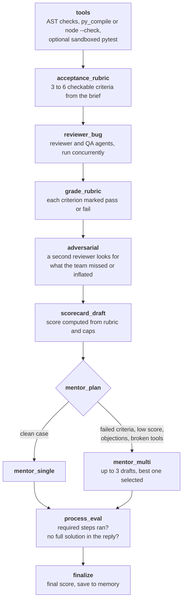
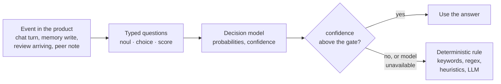
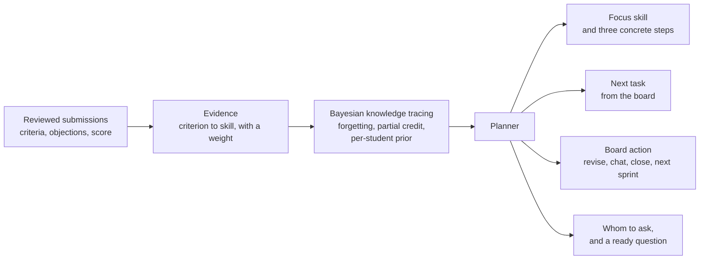
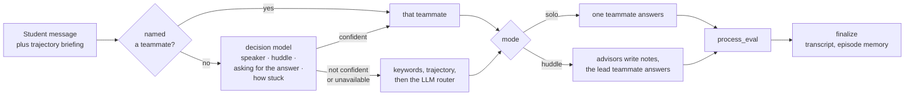

# Desk

A simulated junior dev team for learning to program. It reviews your code, keeps track of what you keep getting wrong, and decides what you should do next.


**Status:** research prototype. All services, the client and the agent pipelines are implemented and unit-tested, but nothing has been evaluated with real students yet. What I have measured is how the pieces behave in tests and in simulation. The [limitations](#limitations) section says what that does and does not show.

The interface is in Russian. Screenshots use sample data.

## What it is

A student picks a track (backend, frontend or fullstack) and a level. They get a project split into sprints, and each sprint is a kanban board. They write code in the browser and submit it. A pipeline of LLM agents and deterministic checks reviews the submission against acceptance criteria. Each task allows two attempts by default. Four AI teammates (product, analytics, QA, tech lead) answer questions in a chat.

Between tasks, a knowledge model built from the review outcomes decides what happens next: fix one specific criterion, ask one specific teammate, repeat a skill that is fading, or take a particular task from the board. At the end of a sprint the student gets a performance-review letter with a grade and salary change. The whole thing is meant to feel like the first months of a job.

It is about 30,000 lines of Python across five services and 6,900 lines of TypeScript, with 313 unit tests.

## Five things worth a look

1. **A reviewer that cannot grade by feel.** The final score is computed. The LLM agents fill in a rubric, and the number comes from the rubric pass rate, capped by hard evidence: broken syntax, failing tests, objections from a second reviewer, skipped steps in the process. An agent cannot talk its way past a cap. See [the review pipeline](#the-review-pipeline).

2. **Knowledge tracing on top of LLM review output.** Each acceptance criterion is mapped to one or two of 14 skills. A Bayesian knowledge tracing model with forgetting turns pass/fail outcomes into a per-skill estimate, and a planner turns that into a next step. I derived the model parameters from behavioural constraints instead of picking them by hand. See [the learning trajectory](#the-learning-trajectory), and [docs/trajectory.md](docs/trajectory.md) (in Russian) for the full derivation.

3. **The agents are audited too.** Every review and every chat turn records which steps ran. A process check lowers the score if required steps were skipped, and flags a mentor reply that pastes a complete solution.

4. **Decisions are typed, not generated.** The small choices inside the product (who should answer, is this worth remembering, which skill does this criterion test, did the student find the planted bug) go to a decision model that returns probabilities over options I define, not text. It cannot invent an option, and every call has a deterministic fallback behind a confidence gate. See [typed decisions](#typed-decisions).

5. **The domain carries the motivation.** Grades, salary, a bonus that can be spent on extra help, a Friday demo, a night incident, a peer-review task where the student finds a planted bug in code written by an LLM, and badges that are awarded for closed work rather than time spent. What the student is shown depends on their grade. See [the career layer](#the-career-layer).

## Screens

The report after a submission. The score is on the left; the trajectory block says which skill to work on, why, and in which order.


The team chat. The briefing at the top comes from the trajectory, so the teammates start from the same picture of the student.


The short feedback loop: the grade ladder, counters, the next goals and the badge shelf. Every number here is server-side and comes from closed work.


## Architecture



| Service | Owns | Notes |
|---|---|---|
| `api_gateway` | Routing of `/api/{user,task,submission,agents}`, rate limiting, sticky balancing | Redis fixed-window limiter, hash-based sticky routing |
| `user_service` | Accounts, access and refresh tokens, sessions, admin roles | Sessions and role cache in Redis |
| `task_service` | Project templates, sprints, the board, the close gate, career state | Read-through Redis cache in front of Mongo |
| `submission_service` | Submissions, the attempt limit, review results, the learning trajectory | Keeps a local cache of task status and description, fed by events |
| `agent_service` | The review graph, the team chat graph, memory, offline evals | LangGraph, ChromaDB, Langfuse tracing (optional) |

Events go over Kafka. Topic names come from settings.

| Event | Producer | Consumer | Why |
|---|---|---|---|
| user registered, profile updated | `user_service` | `task_service` | Keeps the student's direction and level next to their projects |
| task created, status updated | `task_service` | `submission_service` | Lets submissions be validated without a call back to `task_service` |
| submission created | `submission_service` | `agent_service` | Starts a review |
| submission reviewed | `agent_service` | `submission_service` | Stores the review |

Each service is layered as presentation, application (use cases and ports written as `Protocol`s) and infrastructure, and wired with [dishka](https://github.com/reagento/dishka). The rules that matter most, meaning scoring, the trajectory model, the close gate and the career rules, are plain functions with no I/O, so they are tested without any infrastructure.

## Life of a submission



Some details that took a while to get right:

- **One pending review per task, even under a race.** If two submissions arrive at once, the one with the smaller id survives and the other is deleted.
- **Failures are counted fairly.** An infrastructure failure before the review started does not use up an attempt. A review that ran and failed does.
- **Reviews survive restarts.** The review graph is checkpointed in Redis under a key built from the submission, the attempt and a hash of the code. A redelivered Kafka message resumes from the last finished node or reuses a finished result. If the checkpoint store itself fails, the run stops instead of silently starting over.
- **Kafka consumers commit offsets by hand, with retries**, and applying a review result twice has no effect.

## The review pipeline



The score is not something a model writes. It is built like this:

```
task, reliability      integers 1..10 from the reviewer and the QA agent
base                   weaker + (stronger - weaker) // 4
rubric score           1 + round(9 * share of criteria passed)
final                  min(base, rubric score, every applicable cap)
```

| Cap | Trigger |
|---|---|
| 2 | Syntax or compilation fails |
| 4 | Tests run in the sandbox and fail |
| 5 | Two or more error-level findings from the tools |
| 5 or 7 | Half or more of the required criteria fail, or some of them fail |
| 5 or 7 | The adversarial reviewer objects with high or medium severity |
| 5 | The process check finds a pasted full solution, or three or more violations |
| 6 | The process check finds that the tools or the sandbox were bypassed |

The adversarial reviewer has deterministic rules of its own. They replace its verdict when the LLM call fails, and they override an LLM that agrees with the team when the rules see a high-severity contradiction, for example a top score for code that does not compile. The tool report also carries earlier reviews of the same task and a short profile of the student, so feedback can refer to what was said before.

**Code execution.** The sandbox is a subprocess in a temporary directory with CPU, memory, process-count and file-size limits, a scrubbed environment and a timeout. It is not container isolation. Running student tests is off by default and cannot be switched on in a production environment. Static analysis and compilation always run, for Python and JavaScript. A missing Node.js makes the JavaScript check fail rather than pass.

## Typed decisions

A lot of what this product does is not writing text. It is choosing: which teammate should answer, whether a chat episode is worth keeping, which skill a criterion tests, whether a review note names the real bug. Running those through a chat model costs seconds and tokens, and the answer has to be parsed back out of prose, where a model can return a teammate who does not exist.

Since September 2026 there is a model built for exactly this shape of question. [Jev](https://openrouter.ai/docs/guides/community/jev) from TypeSafe AI is a *System One* model. It does not generate tokens; it returns probabilities over options the developer defines. Three primitives cover everything here: `noul` (probability that a statement holds), `choice` (one option out of an enumeration) and `score` (a position on an ordered scale of 2 to 10 described levels). A request carries a state and a map of typed questions, and several questions are answered in one call.



Where it is used, and what happens without it:

| Decision | Question | Fallback |
|---|---|---|
| Who answers in the chat | `choice` over the four teammates, plus a `noul` for "this needs several roles" | `@mention`, then keyword routing, then the LLM router |
| How to answer | `noul` "the student is asking for the finished code", `score` of how stuck they are | No extra instruction in the prompt |
| Keep a chat episode in memory | `noul` "will this still be useful in a week" | The record is kept |
| Order of retrieved documents | `score` of relevance per candidate, in one call | Vector order after fusion |
| Which skill a criterion tests | `choice` over the 14 skills, per criterion, one call per review | The keyword classifier |
| Peer review and Friday demo verdicts | `noul` "the note names this bug", "the answer is about this criterion" | The existing LLM-with-quoted-evidence check |

Four properties made this worth wiring in:

- **The answer is inside the enumeration by construction.** The chat router cannot return a fifth teammate, and the skill tagger cannot invent a fifteenth skill. That removes a whole class of parsing and validation code.
- **One call, several decisions.** A chat turn asks four questions at once: who speaks, is this a huddle, is the student asking for the answer, how stuck are they. Routing and teaching tone come out of the same request.
- **Probabilities are usable numbers.** The skill tagger's top two probabilities become the weights of the observation that reaches the knowledge model, so an ambiguous criterion contributes to two skills instead of being forced into one.
- **A prompt injection cannot move a verdict.** The peer-review note is data in the state, not an instruction: the answer can only be a probability of yes.

Every call site keeps its old path. The client returns an empty answer instead of raising, on a timeout, a 4xx, a malformed body or an answer below the confidence gate, and after three failures in a row it stops calling for a minute so a bad key does not add latency to every request. With `AGENT_SERVICE_JEV_ENABLED=false` and `SUBMISSION_SERVICE_JEV_ENABLED=false`, which is the default, the product behaves exactly as it did before.

The code: [`decisions/questions.py`](agent_service/app/application/decisions/questions.py) is the typed-question layer, [`decisions/policies.py`](agent_service/app/application/decisions/policies.py) holds the question sets and the thresholds, and [`infrastructure/decisions/jev_client.py`](agent_service/app/infrastructure/decisions/jev_client.py) is the client.

**This is engineering, not a result.** I have no accuracy numbers for the decision model against human labels, so nothing in the evaluation section depends on it being switched on.

## The learning trajectory

An earlier version of this was a hand-weighted formula over four numbers. It could say that a student was doing poorly, but not at what. I replaced it with a model of individual skills. [docs/trajectory.md](docs/trajectory.md) (in Russian) has the derivations, the references and the full tables; this is the summary.



**Skills and evidence.** There are 14 skills (edge cases, validation, error handling, testing, algorithms, data structures, API design, storage, concurrency, security, and so on). Every criterion in a review is one pass/fail observation against one or two of them. Objections from the adversarial reviewer count as weaker negative evidence, weighted by severity. The final score is used only when a review has no criteria.

The mapping from a criterion to skills is the weakest link in this chain, so it is computed once, when the review arrives, and stored next to the submission. A keyword classifier over word stems does it by default. When the decision model is enabled, a `choice` question per criterion does it instead, and the two top probabilities become the weights of the observation, so an ambiguous criterion splits 0.6 / 0.4 between two skills instead of landing entirely in one. Criteria the model is not confident about fall back to keywords, so a trajectory stays reproducible either way.

**The model.** Each skill has a probability `P` that the student knows it. One submission updates it in three steps:

```
1. forget   P <- P0 + (P - P0) * 2^(-dt / h)      h doubles after a success on a different day,
                                                  halves after a failure
2. observe  Bayes update over all observations of the submission,
            each weighted by its reliability (a tempered likelihood)
3. learn    P <- P + (1 - P) * T                  once per submission, not once per criterion
```

The prior `P0` for a skill the student has not met yet comes from how they did on other skills, so a strong student does not start every new skill at the population mean.

**Parameters without data.** I have no logs of real students, so I did not fit `(P0, T, slip, guess)`. I wrote seven behavioural requirements instead. Examples: one clean submission must already predict a pass, two in a row must not count as mastery, three in a row must, and a failure after three successes should be read as a slip rather than a gap. A grid search then picked the values with the largest smallest margin across all seven: `(0.30, 0.30, 0.05, 0.30)`. The readiness threshold is not tuned either. The review scale gives `score = 1 + round(9 * pass rate)`, so a score of 8 needs a pass rate of 0.722, and that is the bar.

**What it decides.** It separates a gap from a slip by computing `P(knows | failed)`. A gap sends the student to the right teammate with a ready-made question; a slip means "check your code again". It picks a focus skill in a fixed order: unmet criteria of the current task, then a skill that is fading, then the skill where one more task gains the most, then something harder. The next task from the board maximises the expected realised gain, `(1 - P) * T * P_success`. This is the zone of proximal development written as a formula, without an extra tuning constant.

**Evidence, and how far it goes.** I generated 200 synthetic students over 24 tasks each, 10 seeds. The generator is an Additive Factors Model with forgetting, so it is deliberately not the model being tested. The task is to predict each criterion before it is graded.

| Predictor | AUC | Log loss |
|---|---|---|
| The earlier hand-weighted formula | 0.643 ± 0.017 | 0.709 ± 0.024 |
| Success rate of the whole student | 0.663 ± 0.013 | 0.638 ± 0.027 |
| Success rate per skill | 0.685 ± 0.024 | 0.629 ± 0.021 |
| BKT without forgetting | 0.687 ± 0.015 | 0.651 ± 0.031 |
| **BKT with forgetting (this model)** | **0.689 ± 0.013** | **0.627 ± 0.027** |

It is clearly better than the formula it replaced and matches a strong per-skill baseline on prediction. The difference in what it can do shows up elsewhere. Asked to name the student's weakest skill, it is right 32% of the time, against 15% for a random pick and 13% for "the skill they failed last". Both results depend on the simulator's assumptions. They show the model behaves sensibly, not that it helps real students.

## The team chat



Sara (product), Mike (analytics), Emma (QA) and John (tech lead) each have a persona and a focus area. Emma retrieves from the bug-pattern notes, the others from the best-practice notes. A message that touches two areas becomes a huddle led by John. When the trajectory says the student should talk something through, the reply comes from the teammate who owns the weak skill, and the input box is prefilled with a ready question.

Naming a teammate always wins. Otherwise one decision call answers four questions about the turn, and two of them never reach the router: whether the student is asking for the finished code, and how stuck they are. Those become instructions to the teammate who answers: hold back the patch and name the place in their code, or slow down to one step and start from what already works. Asking for help and asking for the answer are different requests, and the second one deserves a different reply, not a refusal.

## The career layer

| Grade | Salary (simulated, RUB) | What changes |
|---|---|---|
| Intern | 70,000 | One teammate per chat turn. Acceptance criteria are shown after the first submission |
| Junior | 110,000 | The brief as written |
| Junior+ | 150,000 | Criteria are visible up front. The student picks which task to start. A peer-review task appears |
| Strong | 190,000 | The brief loses its step-by-step plan. One appeal per sprint |
| Offer | 240,000 | As Strong, and the student chooses the next project's direction and can reopen old letters |

What is shown by grade is decided in the client (`frontend/src/lib/career-rights.ts`), not enforced by the API.

- **Sprint end.** When the tasks are done, the student gives a Friday demo (a two to four sentence pitch and one question). Then a letter arrives from the tech lead. It is a promotion (next grade, plus a bonus of 20% of the new salary, halved if the pitch was weak), no raise (most tasks were closed weakly), or a freeze (the trajectory is thin). A thin trajectory freezes the raise; it does not block the next sprint. If the trajectory service cannot be reached, completion is held.
- **Bonus.** It can be spent during the next sprint on an extra review round, a one-turn session with Emma, or criteria before submitting. Whatever is left is replaced by the bonus in the next letter.
- **Night incident.** An optional task that arrives as a message from Emma: production is returning 500. A full pass adds a one-off bonus to the letter.
- **Peer review.** From Junior+, the student reads a snippet generated by the LLM with one planted bug and writes down what is wrong. The generator is checked so the bug text does not leak into the code, and a fixed snippet is used if generation fails. The verdict is a typed decision; the LLM only writes Emma's line once the verdict is in.

**The short loop.** A grade arrives once a sprint, which is too rare to tell a student they are getting somewhere. Eleven badges fill the gap: first pass, closed without a second attempt, a 9 or a 10, three and five passes in a row, the planted bug found, the night incident closed, a pitch that held, a promotion, a bonus spent on help, three sprints. Each one is a counter reaching a target, so the same pair produces the goals shown next to the shelf: what is left, and how far along it is. Counters move only on closed work (a pass on the board, a sprint accepted), never on time spent in the editor or pages opened. The award is computed from stored state rather than from an event log, so a badge cannot be won twice and the whole shelf can be recomputed. Awards come back in the response of the request that earned them, and the client shows the card on whatever screen the student is on.

## Memory

| What | Where | Access |
|---|---|---|
| Best practices, bug patterns | ChromaDB, semantic layer, from Markdown files in `agent_service/app/infrastructure/knowledge` | Vector search |
| Past reviews, chat episodes | ChromaDB, episodic layer, with age limits and recency weighting | Vector search, scoped by user |
| **Student profile** | MongoDB, one document per student, at most two typical problems | Direct read by `user_id` |
| Chat transcripts | MongoDB, thread per user and task | Direct read |
| Review and chat run state | Redis (LangGraph checkpoints, with a TTL) | By thread id |
| Retrieval cache | Redis | By query |

The student profile used to live in the vector store. It is a single short record per person, so similarity search added nothing: the record was either found or silently missing when its embedding did not rank. Now it is fetched by key.

Four rules keep the vector layers from turning into a landfill:

- **Ownership is a filter in the store, not a filter after the search.** Private types carry a `user_id`, and it goes into the Chroma `where` clause for the episodic layer. Before, another student's documents could take up half of the top-k and be dropped afterwards, which cost recall for the student who was actually asking. Shared knowledge has no owner, so the filter is only applied when every requested type is private.
- **A repeat merges instead of piling up.** Before writing, a near-duplicate of the same type and owner is looked up by cosine distance. If one is there, the new text replaces it under the same id, the first-seen date and the use counter survive, and the timestamp is refreshed, so a confirmed observation becomes fresh again. That is the forgetting curve of the trajectory model pointed the other way.
- **Use is a signal.** Documents that actually reach a prompt get a use counter. Ranking weight is freshness plus a bounded bonus that grows as `uses / (uses + 3)`, so the third use adds half of what the bonus can ever give and the hundredth adds almost nothing. Memory decays with time and strengthens with use.
- **Writes are gated.** Text is compressed, empty or filler text and pasted solutions are rejected, personal records need a user id, and when the decision model is on, a chat episode has to pass "will this still be useful in a week". Retrieved documents are reranked by a relevance score per candidate; anything the model confidently calls off-topic is dropped before the prompt is built. Both gates fail open.

## Testing and evaluation

- **313 unit tests** (`submission_service` 60, `task_service` 106, `agent_service` 147). They cover the scorecard and its caps, the close gate, the knowledge model, the planner, memory rules (ownership filters, merging, reinforcement, both gates), checkpoint round trips, routing, the typed-question layer and its client, the badge rules, and the career rules. The decision model is tested against recorded request and response shapes, including a timeout, a 429, a malformed body, an option outside the enumeration, and the cooldown after repeated failures.
- **Offline eval harness** in [`agent_service/evals`](agent_service/evals). It runs the deterministic part of the pipeline (tools, rubric, caps) with no LLM and checks the expected caps, and can run a small set of LLM-backed review and chat cases against a running stack. The dataset is small: 5 review cases and 5 chat cases. It is a regression net.
- **Simulation** of the trajectory model, as above: `python -m submission_service.app.application.trajectory.simulation`.
- **Load scenario** for the gateway in [`tests/locust`](tests/locust). I have no results to publish.

## Observability and deployment

- **Telemetry.** Services export OpenTelemetry traces to Tempo, logs go through Promtail to Loki, metrics go to Prometheus with Alertmanager, and Grafana ships with provisioned dashboards. Each graph node is a span. LLM calls can be traced in Langfuse (off by default).
- **Compose.** `docker-compose.yml` starts the services, the client, Kafka and the observability stack.
- **Kubernetes.** Helm charts for each service and an umbrella chart (`charts/`). Argo CD applications, Istio, Cilium, an HAProxy and Keepalived edge, external-secrets against Vault, and kube-prometheus-stack are described under `gitops/`. Terraform bootstraps namespaces and base secrets (`infra/`), and an Ansible role installs Kafka with Strimzi (`ansible/`).
- **CI.** A GitHub Actions workflow on a self-hosted runner builds the images with Kaniko, commits the new image tag to the Helm values, and triggers an Argo CD sync when credentials are configured.

These are deployment definitions. I have not run them at scale.

## Running it

You need Docker, a MongoDB and a Redis reachable from the containers (the compose file does not start them), and an API key for an OpenAI-compatible endpoint.

```bash
cp docs/.env.example .env      # fill in hosts, secrets and the LLM settings
docker compose up --build
```

The decision model is optional. To switch it on, set `AGENT_SERVICE_JEV_ENABLED` and `SUBMISSION_SERVICE_JEV_ENABLED` to `true` and put an OpenRouter key in `*_JEV_API_KEY`; without them every decision takes its deterministic path.

| URL | What |
|---|---|
| http://localhost:3000 | Client |
| http://localhost:8005 | API gateway |
| http://localhost:3001 | Grafana |
| http://localhost:4000 | Langfuse |

The repository ships the platform, not a curriculum. There is no seed data, so before the first login:

1. Register a user in the client.
2. In MongoDB, insert `{ "user_id": <your id>, "role": "superadmin" }` into the `admins` collection of the user database. There is no bootstrap command for this yet.
3. Open the admin panel and create a project template. Sprints are entered as JSON; the panel starts with an example.

**Tests.** The services read their settings when the code is imported, so the environment must be filled in even for unit tests. They do not connect to anything, so any values will do:

```bash
python -m venv .venv && source .venv/bin/activate
pip install -r submission_service/requirements.txt -r task_service/requirements.txt \
            -r agent_service/requirements.txt pytest

set -a; source <(sed -E 's/=$/=1/' docs/.env.example); set +a
pytest submission_service/tests task_service/tests agent_service/tests
```

Python 3.12 is what the images use.

## Limitations

- **No study with real students.** I do not know whether this improves learning. The trajectory results come from simulation, and their assumptions are the simulator's.
- **The skill map is unvalidated.** Criteria are assigned to skills by keyword patterns over word stems, or by the decision model when it is enabled. Neither has been checked against human labels, and a wrong assignment feeds straight into the knowledge model.
- **The decision model is unmeasured.** Switching it on changes routing, what is remembered and how criteria are tagged. I know it fails safely, because every call site keeps its old path behind a confidence gate; I do not know how often it is right. Measuring it needs the same labelled sample as the skill classifier.
- **The parameters are derived, not fitted.** With real logs they should be estimated (EM, or a grid search on likelihood), and the seven constraints are a good sanity check for the result.
- **LLM grades vary.** The caps make scores more predictable, not more valid. I have not measured agreement between the pipeline and human graders.
- **The sandbox is process-level.** It is fine for a prototype and would need containers before untrusted use.
- **Language and scope.** Prompts, personas and the interface are in Russian. Static analysis covers Python and JavaScript only.
- **Little content.** No task corpus, and the eval dataset is small. The first superadmin is created by hand.
- **Grade-dependent hints are client-side.** A determined student can see everything through the API.

Things I would do next, in order: collect real submission logs from a small cohort, label a sample of criteria to measure the skill classifier and the reviewer against humans, fit the model parameters, and compare the trajectory against a fixed task order in a classroom trial.

## Where to start reading

| File | What is in it |
|---|---|
| [`review/scorecard.py`](agent_service/app/application/review/scorecard.py) | How the score and the caps are composed |
| [`graphs/review_graph.py`](agent_service/app/application/graphs/review_graph.py) | The review pipeline as a LangGraph |
| [`review/agent_path.py`](agent_service/app/application/review/agent_path.py) | The process checks on the agents |
| [`trajectory/knowledge.py`](submission_service/app/application/trajectory/knowledge.py) | The knowledge model: forgetting, evidence, per-student prior |
| [`trajectory/planner.py`](submission_service/app/application/trajectory/planner.py) | Focus skill, plan, and choice of the next task |
| [`trajectory/calibration.py`](submission_service/app/application/trajectory/calibration.py), [`simulation.py`](submission_service/app/application/trajectory/simulation.py) | Where the parameters and the numbers above come from |
| [`career.py`](task_service/app/application/career.py) | Grades, letters, bonus and their rules |
| [`quests.py`](task_service/app/application/quests.py) | Counters, badges and the goals built from them |
| [`decisions/questions.py`](agent_service/app/application/decisions/questions.py), [`policies.py`](agent_service/app/application/decisions/policies.py) | Typed questions, and every question the product asks |
| [`memory/layered_memory.py`](agent_service/app/infrastructure/memory/layered_memory.py) | Ownership filters, merging, reinforcement, rerank |

## Repository map

```
api_gateway/          reverse proxy, rate limiting
user_service/         accounts and roles
task_service/         projects, sprints, board, career rules, badges
submission_service/   submissions, review loop, learning trajectory
  app/application/trajectory/   skills, evidence, knowledge model, planner, calibration, simulation
agent_service/        review graph, team chat, memory, evals
  app/application/review/       rubric, scorecard, adversarial check, process check
  app/application/decisions/    typed questions for the decision model
  app/application/graphs/       LangGraph definitions
  evals/                        offline evaluation
frontend/             React client
charts/ gitops/ infra/ ansible/   deployment definitions
monitoring/ monitoring_python/    telemetry configuration and FastAPI instrumentation
docs/                 trajectory model write-up, env template, images
```

## Author

Alexandra Kalimullina, [@alexaaa-a](https://github.com/alexaaa-a).
